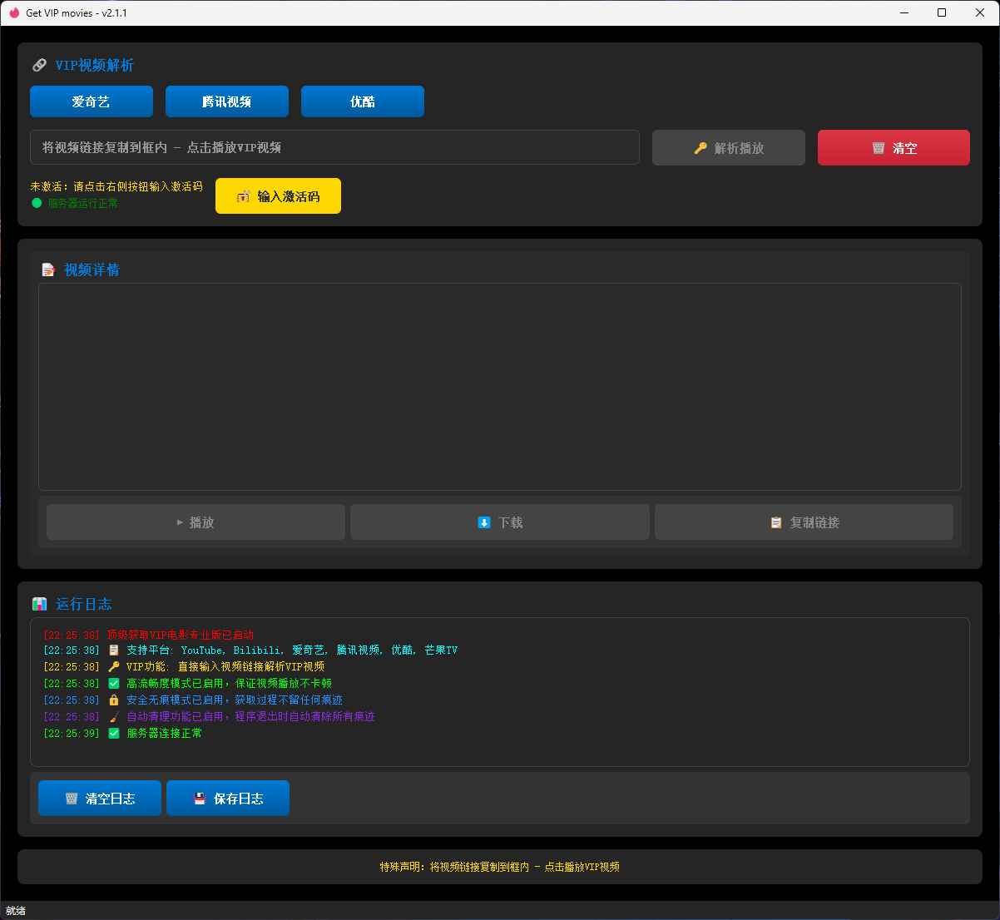

# 🎬 VIP电影解析器 - Get VIP Movies

**免费VIP视频解析 | 全网影视 | 高清播放 | 完全开源**

    

     

*专业的VIP视频解析工具，支持爱奇艺、腾讯视频、优酷、芒果TV等主流平台*

🚀 [立即下载](https://github.com/xuanxuan205/Get-VIP-movies/releases/latest) | 🐛 [问题反馈](https://github.com/xuanxuan205/Get-VIP-movies/issues)

## 📸 程序界面展示

 

---

## 🎯 项目简介

**Get VIP Movies** 是一款功能强大的VIP视频解析工具，支持解析各大视频平台的VIP内容。采用Python开发，界面简洁美观，操作简单便捷。支持爱奇艺、腾讯视频、优酷、芒果TV、Bilibili等主流视频平台的VIP内容解析。

### 🌟 核心特性

- 🎬 **全网VIP解析**: 支持爱奇艺、腾讯视频、优酷、芒果TV等主流平台
- 🔍 **智能搜索**: 多平台视频内容搜索，快速找到想看的内容  
- 📱 **跨平台支持**: Windows、Linux、macOS全平台兼容
- 🎨 **现代化界面**: 基于PyQt5的美观用户界面
- ⚡ **高速解析**: 优化的解析算法，快速获取播放链接
- 🔒 **安全可靠**: 开源代码，安全透明，无恶意行为

| 支持平台 | 解析能力 | 特色功能 |
|---------|---------|---------| 
| 🎬 **爱奇艺** | VIP电影、电视剧、综艺 | 高清画质，流畅播放 |
| 📺 **腾讯视频** | 独播剧集、电影大片 | 支持4K超清解析 |
| 🎭 **优酷** | 热门综艺、经典影视 | 多线路解析保障 |
| 🥭 **芒果TV** | 自制内容、热门综艺 | 专属解析通道 |
| 📹 **Bilibili** | UP主内容、番剧动漫 | 弹幕同步显示 |
| 🌐 **YouTube** | 国外视频内容 | 多语言字幕支持 |

---

## 🚀 快速开始

### 系统要求

- **操作系统**: Windows 10+ / Linux / macOS 10.14+
- **Python**: 3.7 或更高版本
- **内存**: 最小 512MB，推荐 2GB+
- **存储**: 100MB 可用空间

### 📥 安装方式

#### 方式一：直接下载（推荐）

1. 访问 [Releases页面](https://github.com/xuanxuan205/Get-VIP-movies/releases/latest)
2. 下载适合你系统的安装包

### 🎮 使用方法

1. **启动程序**: 运行 `main.py` 或双击 `启动运行.bat`
2. **输入链接**: 在输入框中粘贴视频链接
3. **解析播放**: 点击"解析播放"按钮
4. **享受观看**: 在弹出的播放器中观看视频

---

## 📋 功能特性

### 🔍 视频搜索

- **多平台搜索**: 支持YouTube、Bilibili、爱奇艺等平台
- **智能匹配**: 自动识别视频类型和来源
- **批量处理**: 支持批量搜索和解析

### 🎬 VIP解析

- **全网支持**: 覆盖主流视频平台的VIP内容
- **高清画质**: 支持1080P、4K等高清格式
- **多线路**: 提供多个解析线路，确保成功率

### 📱 用户界面

- **现代设计**: 采用Material Design风格
- **响应式布局**: 适配不同屏幕尺寸
- **暗色主题**: 护眼的暗色界面设计

### 🔧 高级功能

- **下载支持**: 支持视频下载到本地
- **播放列表**: 管理和组织视频收藏
- **历史记录**: 自动保存观看历史

---

## 🎨 界面预览

### 主界面
- 简洁的视频链接输入框
- 一键解析播放按钮
- 实时日志显示区域

### 搜索界面
- 多平台搜索选项
- 搜索结果列表展示
- 视频详情信息面板

### 设置界面
- 解析线路配置
- 播放器设置选项
- 下载路径管理

---

## 📚 使用教程

### 基础使用

1. **获取视频链接**
   - 在爱奇艺、腾讯视频等平台找到想看的视频
   - 复制视频页面的URL链接

2. **解析视频**
   - 将链接粘贴到程序输入框
   - 点击"解析播放"按钮
   - 等待解析完成

3. **观看视频**
   - 程序会自动打开播放器
   - 享受高清VIP内容

### 高级技巧

- **批量解析**: 可以同时处理多个视频链接
- **自定义播放器**: 支持配置外部播放器
- **下载管理**: 可以下载视频到本地观看

---
## 🔗 相关链接

- **项目主页**: [https://github.com/xuanxuan205/Get-VIP-movies](https://github.com/xuanxuan205/Get-VIP-movies)
- **问题反馈**: [Issues](https://github.com/xuanxuan205/Get-VIP-movies/issues)
- **更新日志**: [CHANGELOG.md](CHANGELOG.md)

---

## 🤝 社区支持

### 获取帮助

- **GitHub Issues**: 报告问题和提交反馈
- **讨论区**: 参与技术讨论和经验分享
- **Wiki**: 查看详细的技术文档

### 贡献代码

我们欢迎社区贡献！请查看贡献指南了解如何参与项目开发。
---

## ⭐ Star History

---
